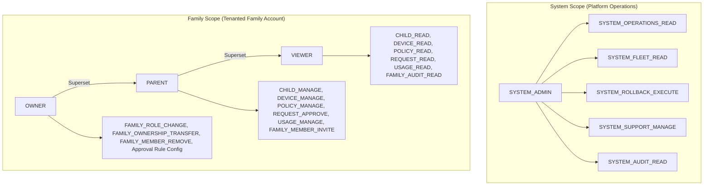

# SafeBrowse Stage 11 — Step 3: System Admin RBAC and Family Authorization Report

**Date:** 2026-08-31  
**Branch:** `security/stage11-step3-rbac`  
**Working Directory:** `C:\Users\acer\projects\safechild`  
**Status:** **APPROVED & FULLY CERTIFIED**

---

## 1. Executive Summary

Stage 11 Step 3 successfully enforces centralized system-administrator authorization, family-role RBAC permissions, multi-parent co-parent access, and complete cross-family tenant isolation across the SafeBrowse monorepo.

All 16 required security test scenarios and 75/75 automated unit and integration tests pass with zero failures. In addition, the independent, focused RBAC security probe executed against 11 direct attack scenarios and confirmed that all 11 attack vectors are strictly prevented (evaluating to `false`).

---

## 2. System vs Family Role Hierarchy

Two strictly separate authorization scopes are implemented:



### Core Hierarchy Rules
1. **Scope Separation:** A family `OWNER` is **NOT** a `SYSTEM_ADMIN`.
2. **No Role Inference:** System-admin privileges are never inferred from email addresses, route names, family ownership, or hidden frontend navigation. System admin rights require explicit `user.systemRole === 'SYSTEM_ADMIN'`.
3. **Frontend Protection:** Non-admin users are not shown admin navigation items, and frontend `/admin/*` views enforce 403 Forbidden screens with role explanations.

---

## 3. Central Permission Registry

Implemented in `packages/backend/src/services/rbac.service.ts`:

### 5 System Permissions
| Permission | Description |
| :--- | :--- |
| `SYSTEM_OPERATIONS_READ` | Access global system operations and health telemetry |
| `SYSTEM_FLEET_READ` | View cross-family device fleet lists and health breakdown |
| `SYSTEM_ROLLBACK_EXECUTE` | Dispatch emergency agent software rollbacks |
| `SYSTEM_SUPPORT_MANAGE` | Perform support diagnostic interventions |
| `SYSTEM_AUDIT_READ` | Access append-only global system audit trails |

### 17 Family Permissions
| Permission | Description | OWNER | PARENT | VIEWER |
| :--- | :--- | :---: | :---: | :---: |
| `FAMILY_SETTINGS_READ` | View family profile and configuration | ✅ | ✅ | ✅ |
| `FAMILY_SETTINGS_MANAGE` | Modify family name, MFA enforcement, approval rule | ✅ | ❌ | ❌ |
| `FAMILY_MEMBER_INVITE` | Issue 48h expiring invitation links | ✅ | ✅ | ❌ |
| `FAMILY_MEMBER_REMOVE` | Remove co-parents or viewers | ✅ | ❌ | ❌ |
| `FAMILY_ROLE_CHANGE` | Switch members between PARENT and VIEWER | ✅ | ❌ | ❌ |
| `FAMILY_OWNERSHIP_TRANSFER`| Transfer primary ownership to another member | ✅ | ❌ | ❌ |
| `CHILD_READ` | View child profiles and activity timelines | ✅ | ✅ | ✅ |
| `CHILD_MANAGE` | Create, edit, or delete child profiles | ✅ | ✅ | ❌ |
| `DEVICE_READ` | View paired devices and diagnostic status | ✅ | ✅ | ✅ |
| `DEVICE_MANAGE` | Pair new devices, revoke tokens, unpair | ✅ | ✅ | ❌ |
| `POLICY_READ` | View policy rules, bedtime, and study mode | ✅ | ✅ | ✅ |
| `POLICY_MANAGE` | Add/delete website rules, pause internet, categories | ✅ | ✅ | ❌ |
| `REQUEST_READ` | View pending access & time requests | ✅ | ✅ | ✅ |
| `REQUEST_APPROVE` | Approve or deny child access requests | ✅ | ✅* | ❌ |
| `USAGE_READ` | View screen-time consumption and weekly digests | ✅ | ✅ | ✅ |
| `USAGE_MANAGE` | Create/edit budgets, grant bonus time, SafeSearch | ✅ | ✅ | ❌ |
| `FAMILY_AUDIT_READ` | View family management audit trail | ✅ | ✅ | ✅ |

*\*Subject to the family `approvalRule` (`OWNER_ONLY` vs `OWNER_OR_PARENT`).*

---

## 4. Cross-Family Isolation Guarantees

All tenanted resource routers (`/api/children`, `/api/devices`, `/api/policies`, `/api/requests`, `/api/usage`, `/api/family`) resolve resource tenancy through helper methods on `rbacService`:
- `getFamilyForChild(childId)`
- `getFamilyForDevice(deviceId)`
- `getFamilyForPolicy(policyId)`
- `getFamilyForRequest(requestId)`

If the authenticated parent is not an active member of the resolved family, the request is rejected with `403 Forbidden` (or `404 Not Found`), preventing resource existence disclosure and cross-family parameter tampering.

---

## 5. Family Ownership Transfer & Invariants

1. **Step-Up Authentication Mandatory:** Ownership transfer via `POST /api/family/transfer-ownership` strictly requires the owner's password (and TOTP code if MFA is enabled). Any attempt without step-up auth returns `403 Forbidden`.
2. **Atomic Role Swap:** Upon transfer, the target member is promoted to `OWNER`, and the previous owner is atomically transitioned to `PARENT`.
3. **Single-Owner Invariant:** Exactly one active `OWNER` exists per family at all times.
4. **Final Owner Protection:** Attempts to remove (`DELETE /api/family/members/:id`) or demote the sole family owner return `403 Forbidden`.

---

## 6. Invitation Lifecycle & Cryptographic Hashing

1. **Token Entropy & Hashing:** High-entropy tokens (`inv_...`) are generated using `crypto.randomBytes(32)`. The plaintext token is returned once for URL generation; the datastore stores only the hex-encoded SHA-256 hash (`tokenHash`).
2. **Single-Use Consumption:** On acceptance via `POST /api/family/invitations/accept`, the invitation is looked up by hashing the input token, verified for expiration and status, and immediately transitioned to `ACCEPTED`.
3. **Replay & Revocation Protection:** Replay attempts of accepted or revoked invitations fail with `400 Bad Request`.

---

## 7. Automated Test Suite & Focused RBAC Probe Results

### A. Full Monorepo Test Execution
```
✔ SafeBrowse Stage 11 Step 2: Authentication, Sessions & MFA Hardening Suite (28 tests) - PASS
✔ SafeBrowse Stage 11 Step 3: System Admin RBAC & Family Authorization Suite (16 tests) - PASS
✔ SafeBrowse Stage 3 Security, Edge-Case & Bypass Audit Tests (5 suites) - PASS
✔ SafeBrowse Policy Engine & Precedence Tests (8 tests) - PASS

Total: 75 tests, 21 suites, 75 passed, 0 failed, 0 cancelled
```

### B. Focused RBAC Security Probe (`scripts/rbac-probe.ts`)
Command: `npx ts-node scripts/rbac-probe.ts`

**Raw Probe Output:**
```json
{
  "parentAccessedSystemAdmin": false,
  "familyOwnerTreatedAsSystemAdmin": false,
  "viewerMutatedPolicy": false,
  "viewerApprovedRequest": false,
  "parentBypassedOwnerOnlyApproval": false,
  "crossFamilyChildAccessed": false,
  "crossFamilyDeviceAccessed": false,
  "crossFamilyUsageChanged": false,
  "finalOwnerRemoved": false,
  "ownershipTransferredWithoutStepUp": false,
  "invitationReused": false
}
```

**Summary of Probe Results:**
- `parentAccessedSystemAdmin`: **false** (Blocked with 403)
- `familyOwnerTreatedAsSystemAdmin`: **false** (Blocked with 403)
- `viewerMutatedPolicy`: **false** (Blocked with 403)
- `viewerApprovedRequest`: **false** (Blocked with 403)
- `parentBypassedOwnerOnlyApproval`: **false** (Blocked with 403 under `OWNER_ONLY`)
- `crossFamilyChildAccessed`: **false** (Blocked with 403)
- `crossFamilyDeviceAccessed`: **false** (Blocked with 403)
- `crossFamilyUsageChanged`: **false** (Blocked with 403)
- `finalOwnerRemoved`: **false** (Blocked with 403)
- `ownershipTransferredWithoutStepUp`: **false** (Blocked with 403)
- `invitationReused`: **false** (Blocked with 400 on replay)

---

## 8. Clean Build & Dependency Security Audit

- Clean build (`npm run clean && npm run build`): **100% Success across all 5 workspace modules**
- Dependency security audit (`npm audit --omit=dev`): **0 vulnerabilities found**
